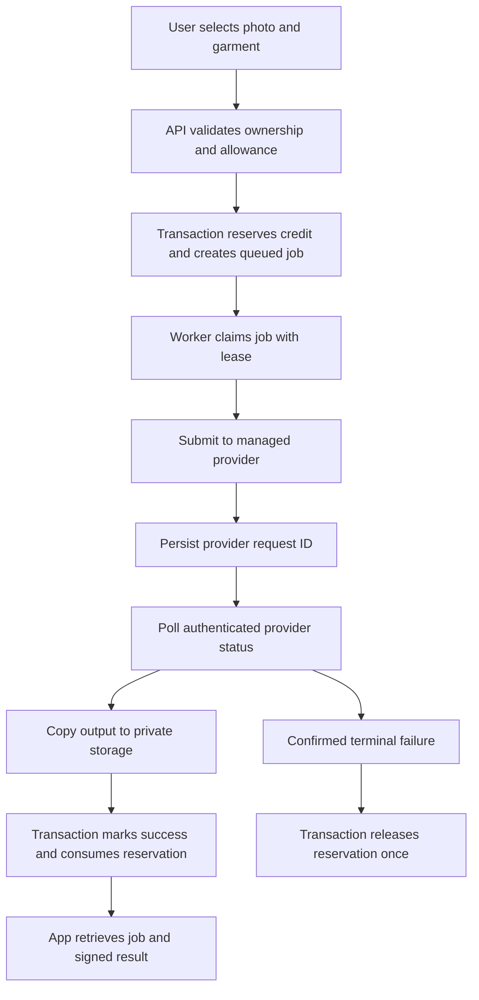

# Tidywaro — completing try-on and building with AI

Prepared September 16, 2026. This is an implementation plan, not a claim of measured provider quality. Start it after the UI prototype milestones in [the build plan](01-Tidywaro-UI-First-Build-Plan.md).

Updated scope: iOS, Android, and a full responsive web application share one product/design system. Use the [Android](04-Tidywaro-Android-Design-Prompts.md) and [web](05-Tidywaro-Web-Design-Prompts.md) companions with the shared prompt library. Provider evaluation and durable job processing serve every platform through the same backend.

## 1. What the first successful try-on must do

A signed-in user selects a private personal photo and one wardrobe garment, sees the cost, requests a preview, closes the app, and returns to a saved result. Failures do not lose the selected inputs or silently consume user credits. The preview should preserve recognizable identity, garment color/pattern/cut, and plausible anatomy.

This is image synthesis. It is not a size recommendation, cloth-physics simulation, or proof that a garment physically fits. The app should describe that distinction in one calm sentence.

Version 1 supports a single top, bottom, or one-piece garment only if that category passes evaluation. An outfit collage remains a useful separate feature. A garment image positioned over a person's photo using percentage coordinates cannot deliver the expected realistic result.

## 2. Recommended technology decision

**First candidate: FASHN v1.6 through the direct FASHN API.** Evaluate it before committing to a production integration. It is documented as stable and supports the one-garment categories needed for the initial scope. Use explicit settings, one output, and a recorded seed during evaluation. [Model reference](https://docs.fashn.ai/api-reference/tryon-v1-6).

**Quality challenger: FASHN Try-On Max.** Benchmark it if v1.6 fails garment/identity fidelity. It is currently documented as Preview, so isolate it behind the same adapter and release flag, and record that lifecycle risk. Do not assume its single-product request means it accepts arbitrary outfits. [Max reference](https://docs.fashn.ai/api-reference/tryon-max).

**Alternative delivery channel: fal-hosted FASHN v1.6.** This is an alternate way to integrate the model, not an independent model-quality comparison. Choose it only if its operational tooling better fits the app. Do not integrate direct FASHN and fal simultaneously at launch. [fal endpoint](https://fal.ai/models/fal-ai/fashn/tryon/v1.6).

Higgsfield is useful in the design workflow for editorial assets. Its name alone is not evidence of a suitable production try-on contract. It can be evaluated later if a documented API, commercial rights, retention rules, costs, and garment-preservation results justify it. Do not build a production feature by automating a consumer generation website.

The current IDM-VTON repository lists code/checkpoints under CC BY-NC-SA 4.0. Do not assume access to a public demo grants commercial rights. Self-hosting it is not the recommended commercial launch path. [Project license statement](https://github.com/yisol/IDM-VTON#license).

### Keep the application architecture small

| Layer | Choice |
|---|---|
| Mobile | Existing React Native/Expo and React Navigation |
| Web | Existing Next.js application, expanded to the full authenticated product |
| UI styling | One versioned semantic token source mapped to native StyleSheet and web CSS; separate appropriate renderers |
| API | Existing TypeScript Express backend with validated contracts |
| Auth/data/files | Supabase Auth, Postgres, private Storage |
| Durable work | Postgres job rows plus one independently running TypeScript worker |
| Generation | One managed provider adapter selected after evaluation |
| Billing | Server-owned entitlements and usage ledger; channel-specific purchase integration |

Deploy the API and worker as separate supervised processes on a host that supports long-running work. The web frontend can deploy independently. Do not run the worker inside an ordinary short-lived web request or add Redis solely because a queue exists; Postgres is sufficient for the initial workload if leases and retries are implemented correctly.

Share API schemas, fixtures, asset references, and pure domain functions across platforms. Keep native secure-storage and browser session handling in separate adapters. Do not assume the existing Expo storage adapter works in a browser. Design web session restoration, callback routes, authorized server access, CSRF protection where cookie-authenticated mutations are used, and narrowly configured API origins explicitly. Tokens/credentials never belong in page URLs. Platform payment methods converge on one server entitlement, with management actions directed to the actual purchase channel.

A job started on Android should be discoverable on iOS/web under the same account. UI state updates through re-fetch/reconciliation; the browser is not a second provider client. Generation charges and credit balances are global per account, including concurrent requests from different devices. Choose feature rollout flags deliberately and explain unavailable features rather than showing broken parity.

## 3. Benchmark before writing the integration

### Inputs

Build a consented, private set of 60 person/garment pairs: 20 tops, 20 bottoms, 20 one-piece garments. Cover different adult body shapes, skin tones, garment colors, patterns, textures, lighting, and acceptable poses. Include realistic phone photos, not only catalog-perfect inputs. Record which cases intentionally violate capture guidance so rejection behavior is evaluated separately.

Keep an untouched holdout subset of 15 of the 60 pairs for the final chosen configuration. Use the other 45 for initial comparison and tuning. A small benchmark is a launch signal, not proof of universal quality.

Use the original garment source and compare a small subset against processed cutouts. Background removal can damage lace, sleeves, hems, and patterns. Do not assume the thumbnail already produced by Tidywaro is the best model input. FASHN recommends preserving source quality and respecting endpoint-specific input bounds. [Preprocessing guidance](https://docs.fashn.ai/guides/image-preprocessing-best-practices).

### Run order and budget

1. Run the 45 development pairs on v1.6 with an explicit configuration and one output each.
2. Review all results before spending on more models.
3. If needed, run the same development set on Max fast/1K and Max quality/1K.
4. Choose one configuration, then run the 15 holdout pairs once. Do not repeatedly tune on the holdout.

At published on-demand pricing, v1.6 is $0.075 per output. Max fast/1K is 1 credit and quality/1K is 3 credits; a credit is $0.075. Running all three configurations across 60 pairs would be 300 credits, or $22.50 in base generation cost. The staged plan above can cost less. This excludes extra runs, taxes, storage, and other processing. Recheck prices before funding the benchmark. No benchmark or purchase has been executed by this plan. [API pricing](https://help.fashn.ai/plans-and-pricing/api-pricing), [Max costs](https://docs.fashn.ai/api-reference/tryon-max).

### Score every result, including failures

Record case ID, input asset versions, category, provider/model, settings, request ID, start/end time, billed amount, output, reviewer scores, and failure reason. Never commit identifiable user photos to Git.

| Dimension | Score 1–5 |
|---|---|
| Garment fidelity | Color, print, logos/text where relevant, silhouette, buttons, sleeves, hem |
| Person preservation | Recognizable identity, natural body shape, skin tone, pose consistency |
| Anatomy | Hands, arms, neck, legs, no extra/missing features |
| Integration | Plausible drape, occlusion, garment boundaries, lighting |
| Product usefulness | Would the user find this helpful for choosing an outfit? |

Suggested initial gate: at least 85% accepted overall and at least 80% in each supported category, with garment/person scores at least 4/5 for accepted outputs and no severe identity/anatomy defect in an accepted output. Use at least two reviewers for borderline cases and examine rejection patterns by input group. These thresholds are proposed product standards, not claims about a provider.

Also measure p50/p95 end-to-end latency and provider cost per accepted preview. A proposed initial latency target is p95 under 90 seconds for ordinary inputs; relax the product promise or restrict scope if the selected model cannot meet it. Do not publish that target as an observed time until measured.

If one category fails, remove that category from launch. If all fail, retain the UI behind a flag and improve inputs or evaluate another commercial API. Do not mask poor fidelity with creative image prompts that produce different clothes.

## 4. Inputs and photo handling

Store original garment photos and UI cutouts separately. Normalize EXIF orientation, strip location metadata from uploaded copies, validate decoded content/type/dimensions, and apply endpoint-specific limits. Avoid needless repeated compression.

For personal photos, request one person in good light, the relevant body area visible, a neutral pose, and limited obstruction. Provide recapture guidance for blurred/cropped inputs. An automated quality check can assist, but it must not invent medical/body assessments or reject users based on appearance.

Create private buckets for personal photos and generated results. The client uploads only to an owner-scoped path authorized by the backend/policies; the backend validates the object before use. Generation requests contain application asset IDs, never arbitrary client-provided URLs.

Mint signed input URLs at worker submission time, with validity sufficient for the measured queue and processing budget. Do not store expiring URLs as the permanent asset identifier. FASHN records submitted URLs and supports base64 delivery; its documentation describes a shorter output availability window for base64 than standard CDN output. Choose a delivery mode deliberately and persist successful outputs promptly to private storage. [Provider retention documentation](https://docs.fashn.ai/api-overview/data-retention-privacy).

Show the user an accurate disclosure about third-party image processing. Never claim “photos never leave your device.” Use an explicit product retention policy, deletion cleanup jobs, and a record of deletion completion. Deleting an input referenced by a running job must cancel it safely or mark it for cleanup after reconciliation; do not recreate deleted account content when a late result arrives.

## 5. One contract across mobile, API, and database

Define a runtime-validated public schema in `packages/shared` and infer TypeScript types from it. Translate SQL snake_case to API camelCase only at the repository boundary. Remove hand-written duplicate types in screens and workers.

Proposed application contract, not a provider API:

```http
POST /v1/tryon/jobs
Authorization: Bearer <user token>
Idempotency-Key: <client-generated request UUID>
Content-Type: application/json

{
  "personPhotoId": "uuid",
  "garmentItemId": "uuid"
}
```

The server chooses provider settings and credit cost from the validated product configuration. The client cannot submit its own cost, user ID, billing status, object path, or provider endpoint.

Both create and status endpoints return one consistent job representation:

```json
{
  "id": "uuid",
  "status": "queued",
  "personPhotoId": "uuid",
  "garmentItemId": "uuid",
  "credit": { "amount": 1, "state": "reserved" },
  "result": null,
  "error": null,
  "createdAt": "ISO-8601 timestamp",
  "updatedAt": "ISO-8601 timestamp"
}
```

On completion, `result` contains an asset ID, authenticated short-lived display URL, and URL expiry. A retrievable result can be re-signed without a new generation. Error objects contain a stable application code, a safe display message, and whether the user can retry. Use the same response structure for cached results; never return `jobId: null` to a screen that requires an ID.

Other routes: `GET /v1/tryon/jobs/:id`, cursor-paginated `GET /v1/tryon/jobs`, and an authorized delete/cancel action with explicit semantics. Same idempotency key plus a different request body returns a conflict; same key/body returns the existing job. A deliberate Regenerate action creates a new key and explicitly consumes another allowance.

The existing code requires these concrete repairs:

- Mobile request fields disagree with `createTryOnJob` in the backend.
- Backend `jobId`/`resultUrl` disagree with mobile `id`/`result_image_url`.
- The queue function omits `user_photo_id` and `credits_charged` needed by the worker.
- Worker `result_image_url` disagrees with database `result_url`.

Update all layers as one tested contract slice; a type assertion cannot repair a mismatched wire response.

## 6. Durable generation lifecycle



Internal states: `queued → submitting → processing → persisting → succeeded`. Additional states: `submission_unknown`, `failed`, and `canceled`. Map internal technical states to plain UI labels. A transport timeout is not proof that the provider failed.

Processing rules:

1. Verify the user token and asset ownership before creating work. Apply per-user and system concurrency limits and a generation-enabled flag.
2. In one database transaction, lock the credit account, reserve a positive server-defined amount, and insert the job. Enforce a unique `(user_id, idempotency_key)` constraint.
3. Claim eligible jobs with row locking, a lease expiry, and an attempt/fencing token. A stale worker cannot overwrite a newer attempt. Use heartbeats when a local operation can exceed the lease.
4. Persist a submission attempt before the external call, then record the provider request ID as soon as it is known. Do not hold a database transaction open during generation.
5. Poll with bounded exponential backoff and jitter, respecting provider limits. Persist next-poll time so a restart resumes work. Mobile polls Tidywaro, never the provider directly.
6. If submission times out without a provider ID, mark it `submission_unknown`. Reconcile using provider-supported lookup/idempotency if available; otherwise queue operator review and apply a documented user-resolution deadline. Never blindly resubmit a potentially charged request. Exactly-once external execution cannot be promised without provider support.
7. Fetch successful output only from trusted provider responses, enforce download bounds, validate the image, and save to a deterministic private object path. Retrying output persistence must not rerun inference.
8. After storage succeeds, atomically mark the job successful and consume the reservation. On a confirmed terminal failure, release it once. If infrastructure fails after the provider succeeded, retry reconciliation/storage before giving up.
9. If the app closes, nothing changes in processing. On resume, fetch recent jobs; refresh expired display URLs.

Use authenticated provider polling for the first release. FASHN documents webhooks, but the reviewed page does not specify a signing protocol. If webhooks are later added, treat them as a wake-up hint and verify status with the provider before granting success or accepting output URLs; do not invent an HMAC header. [Webhook documentation](https://docs.fashn.ai/api-overview/webhooks).

Allow cancellation while queued through a locked state transition that releases the reservation. Once submitted, “Leave screen” does not mean canceled or refunded. Do not advertise provider cancellation until the chosen API supports it.

## 7. Database changes

Prefer additive migrations with verification and a rollout plan. These are schema requirements, not SQL to run unchanged against a deployed database.

| Entity | Required data and constraints |
|---|---|
| Photo/garment assets | Owner, private object path, original/derived role, content version/hash, validated MIME/dimensions, deletion state |
| Try-on jobs | Owner, input IDs/versions, status, request key and payload hash, provider/model/config version, result asset ID, safe error code, timestamps |
| Job attempts | Job ID, attempt/fencing token, lease expiry, provider request ID, submission state, retry count, next poll time |
| Credit account | User, available/reserved balances or a transactionally derived equivalent; nonnegative constraints |
| Credit ledger | User, job/grant reference, operation type, positive amount, unique operation key, timestamp |
| Billing events | Provider, unique event ID, durable payload/reference, processing state, attempts, event ordering metadata |

Ledger operations: grant, reserve, consume, release, and explicit adjustment. Unique keys prevent duplicate renewal grants, duplicate reservations, and duplicate releases. The transaction changes both ledger and balances; maintain a reconciliation query to detect inconsistency.

Clients can read their own status and assets through authorized interfaces. They cannot directly insert runnable jobs or mutate credits/entitlements. Revoke default function execution from public/anon/authenticated as appropriate; grant only narrowly required operations. Any security-definer function has a controlled search path and explicit authorization. The worker uses a server-only administrative credential, and its asset lookups still verify ownership relationships.

Keep cache keys scoped to the user and include input content versions, model/config version, and settings. Do not hash temporary signed URL strings or share cached personal outputs across users. Opening an existing result is free; explicit regeneration is a separate operation. Input deletion invalidates relevant cached access.

## 8. Full outfits: the second milestone

Do not promise one-call full-outfit support based on screenshots or the name of a model. The reviewed FASHN endpoints describe one product/garment input. Establish which multi-item behavior a future provider actually supports before building that UI action.

A bounded experiment can compose two stages, such as bottom then top, passing stage one's image into stage two. Compare both ordering strategies on a fixed set. This can alter the first garment or identity, increase latency, and multiply cost; it is an experiment, not a production-quality guarantee. Keep the original person/photo reference available where the documented API permits it.

Only launch a two-piece mode if the final image passes the same person and garment checks for BOTH pieces. Model it as one parent job with child attempts, resumable intermediate outputs, and a known total reservation. Define partial-failure credit policy before exposing it. Avoid ten-item outfits, shoes/accessories, and arbitrary layering until separate evaluation proves them useful.

If quality remains poor, let users style a multi-item outfit collage and preview one garment at a time. That is still a coherent, honest product.

## 9. AI implementation workflow

Use AI for bounded implementation tasks. Keep the design spec, data contracts, and acceptance tests as durable repository documents. A new chat should receive these documents rather than a vague “make it production ready” request.

Suggested structure, adapted to existing repository conventions:

```text
packages/shared/contracts/      API schemas and inferred types
packages/design-tokens/         Versioned semantic values with native/web mappings
apps/mobile/src/components/    Shared presentation primitives
apps/mobile/src/features/      Wardrobe, outfits, try-on, billing UI/hooks
apps/web/src/                   Responsive product routes and accessible DOM components
apps/bff/src/routes/            Transport and validation
apps/bff/src/services/          Use cases and policy
apps/bff/src/repositories/      Database/storage access and mapping
apps/bff/src/providers/         Managed model adapter
apps/bff/src/workers/           Durable job execution
docs/design/                   Approved frames, tokens, state matrices
docs/decisions/                Provider, billing, retention decisions
```

Keep screens free of provider credentials, credit arithmetic, and direct administrative database operations. Keep source-of-truth data separate from UI loading state. Never use `as any` to conceal contract disagreement. Do not upgrade unrelated dependencies while implementing a screen.

### Prompt E1 — implement one approved UI screen

```text
Implement the attached approved Tidywaro screen for the specified target: [iOS/Android in React Native/Expo, or responsive web in the existing Next.js app]. Read repository instructions and inspect the relevant screen/page, navigation/routes, shared components, and design tokens first. Preserve the selected warm editorial design and shared cross-platform system. Consult the corresponding platform prompt; do not invent a separate aesthetic.

Scope: [screen and attached state frames]. User outcome: [one sentence]. Use shared semantic tokens and reusable components; isolate screen behavior from data access. For this UI-only slice, use deterministic development fixtures behind an explicit adapter with no release fallback. Do not change billing, schema, providers, or unrelated screens.

Implement every visible action and required state. Honor native insets/Back or browser history/focus as applicable, keyboard, large text/zoom, screen-reader labels, reduced motion, and image failures. Match the supplied design with actual rendered screenshots at the target's compact and expanded widths. Compare against the approved other-platform counterpart using identical fixtures. Run relevant existing checks. Report changed files, justified platform differences, verification evidence, and genuine remaining gaps. Do not claim screenshots, browser, or device checks you did not perform.
```

### Prompt E2 — execute the provider evaluation

```text
Prepare a reproducible Tidywaro try-on benchmark using the attached evaluation plan. Read current official provider documentation and confirm model lifecycle, input contract, commercial eligibility, retention, and price. Start with FASHN v1.6; compare Try-On Max only under the specified budget.

Build a local evaluation runner and manifest using consented input references, fixed configurations, and a holdout set. Keep private photos and credentials out of Git and logs. Estimate the maximum spend before execution. If funded API access or consented inputs have not been supplied, finish the runner and list exactly what is needed; do not invent outputs or treat missing measurements as passed gates.

For authorized runs, save contact sheets, per-case metadata, latency/cost records, human score templates, and failure categories. Recommend a configuration only from measured results. Include unsuccessful and visually rejected outputs in the analysis.
```

### Prompt E3 — repair the try-on contract

```text
Implement one canonical, runtime-validated Tidywaro try-on API contract across packages/shared, the Express routes/controllers, mobile API client, and worker/database mapping. Inspect the actual current schema before changing it. Resolve the reviewed snake_case/camelCase, jobId/id, resultUrl/result_image_url/result_url, and missing worker-field mismatches.

Use the application contract in the attached playbook for mobile and web. Keep the provider behind a fake adapter for this slice. Add meaningful integration tests proving request validation, shared response shape, authenticated ownership, cached-result shape, and frontend status interpretation. Do not add a live provider call or billing changes in this PR. Report migration implications and any incompatible deployed clients.
```

### Prompt E4 — implement secure jobs and credits

```text
Implement durable try-on jobs and credit reservations using the attached state machine. Produce a migration and rollout plan that preserves existing data. Ensure atomic creation/reservation, owner checks, unique idempotency keys with payload conflict detection, positive amounts, restricted direct writes/RPC permissions, and exactly-once ledger settlement.

Use a deterministic fake provider and test duplicate submission, one-credit concurrent requests, worker lease expiry, stale-worker fencing, duplicate success/failure, storage failure after inference, and deletion during processing. Add an explicit submission_unknown state; do not claim exactly-once provider execution. Do not deploy migrations or connect paid inference as part of this slice. Show actual test results and explain the recovery path for every state.
```

### Prompt E5 — integrate the chosen provider

```text
Integrate the benchmark-selected provider/configuration into Tidywaro's existing adapter. Re-read current official API documentation; do not guess parameters, idempotency support, cancellation support, or webhook signing. Keep API secrets server-side.

Submit only owner-validated assets with fresh signed input URLs. Persist provider request IDs, poll authenticated status, bound timeouts/retries, and copy validated outputs into private storage before completion. Resume from stored provider IDs after restart. A submission timeout without an ID must enter reconciliation rather than blindly creating another paid request. Provider success plus storage failure retries persistence, not inference.

Add contract tests using recorded/redacted representative responses. Run a paid smoke test only when test inputs and spending authorization are available. Keep generation behind a server-controlled flag and record per-job cost and duration without logging images or signed URLs.
```

### Prompt E6 — connect billing and allowances

```text
Implement Tidywaro's approved billing-channel decision and server-owned entitlements. First inspect existing Stripe, subscription schema, mobile callbacks, and current platform rules. Fix raw webhook ordering, payload mapping, customer mapping, durable event processing, duplicate/stale events, and confirmation-after-server-activation.

Use provider-fetched prices and explicit allowances. Apply renewal credit grants once per billing period. Distinguish purchase pending, active, canceled-until-expiry, grace period, and expired. Preserve user data on downgrade and prevent duplicate subscriptions. Add native restoration if the chosen channel requires it. Test lifecycle transitions, delayed webhooks, repeated events, failed writes, and app cold-start return. Do not enable live charging without the release gates being met.
```

### Prompt E7 — adversarial review of a completed slice

```text
Review this Tidywaro diff as a principal engineer. Trace the actual user journey and identify concrete correctness, authorization, privacy, billing, reliability, and accessibility defects. Focus on evidence in changed code and its callers; avoid speculative style complaints.

Check direct database/RPC bypasses, cross-user object access, duplicate requests, unknown provider outcomes, worker restarts, stale updates, refund duplication, expired URLs, app backgrounding, and unimplemented UI controls. Reproduce meaningful failures with focused tests where possible. Return prioritized findings with exact locations, consequences, and fixes. Distinguish verified failures from untested concerns and list residual risks. Do not claim production readiness from mocks alone.
```

## 10. Required test evidence

| Scenario | Required outcome |
|---|---|
| User B requests User A's photo, item, job, or result | Rejected; no signed URL disclosed |
| Client invokes credit/refund/worker RPC directly | Rejected outside authorized server role |
| Two taps with same key | One job and one reservation |
| Same key, changed inputs | Conflict; original job unaffected |
| Two requests compete for one credit | At most one succeeds |
| iOS, Android, and web submit concurrently | One shared account allowance remains correct across all clients |
| A job is started on one platform and opened on another | Same job/result is retrieved; no new inference or charge |
| Browser refresh, Back, or direct protected URL | Session/route recovery works without resubmitting a mutation |
| Provider submission succeeds but response is lost | Unknown state reconciled; no blind second charge |
| Worker crashes after provider ID is saved | Polling resumes; no duplicate inference |
| Provider succeeds; storage temporarily fails | Persist output again without generation |
| Duplicate completion/failure or expired lease | One terminal settlement; stale worker cannot overwrite |
| User closes app mid-generation | Job continues and appears on return |
| Personal photo/account is deleted during generation | Access revoked; late output cleaned up according to policy |
| Display URL expires | Refresh access without consuming credits |
| Provider is down or budget threshold reached | New generation disabled gracefully; closet/planner remain usable |
| Subscription renews twice via duplicate events | One allowance grant |

Use unit tests for domain transitions, database integration tests for concurrency/RLS, API contract tests for shared schemas, and device end-to-end tests for the user flow. Mocks prove application handling, not visual model quality. Re-run the benchmark when model/configuration changes materially.

## 11. Ordered implementation tickets

1. Shared UI tokens and native/web component mappings; anchor screens across iOS, Android, and web.
2. Remaining UI screens with common fixtures, platform-specific shells, and accessible state galleries.
3. Provider benchmark and written decision.
4. Production configuration, private storage, and authorization repair.
5. Shared try-on contract and mobile mapping.
6. Job/attempt schema, credit ledger, and restricted transactional operations.
7. Fake-provider worker with restart and concurrency tests.
8. Selected-provider adapter and bounded live smoke test.
9. Result persistence, history, deletion, and app-resume behavior.
10. Billing lifecycle, grants, and contextual upgrade return.
11. Device verification, operational alerts, cost cap, and beta release.

Each ticket should be independently reviewable. Record what was actually tested. Senior-level quality emerges from those boundaries and evidence, not from making a single AI prompt ask for the entire app.
